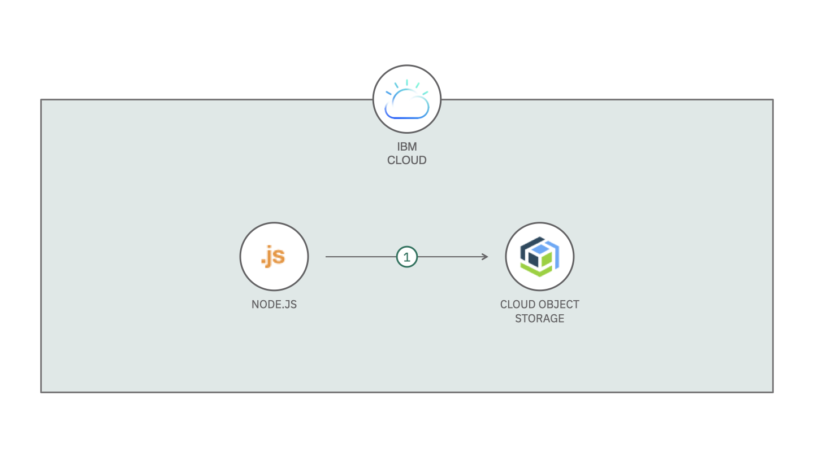

# Cloud Object Storage Versioning

The versioning feature for new objects on IBM Cloud Object Storage (or COS). This source code allow your bucket to perform a copy of each one and new objects sent to it. Once stored, the objects is copied and sent to a second bucket with a new name, which includes the time when it was copied plus the original name (so it can be localizable in the second bucket).



## Deploy to IBM Cloud

Before you get started, you need to install [IBM Cloud CLI](https://cloud.ibm.com/docs/cli/reference/ibmcloud/download_cli.html#install_use) and [IBM Cloud Functions CLI](https://cloud.ibm.com/openwhisk/learn/cli) in your local machine. Then, you need to login in your IBM Cloud account on IBM Cloud CLI (if you haven't already done, run `ibmcloud login`).

### 1. Clone the repository

Download the source code from Github and access the project folder.

```sh
git clone https://github.com/victorshinya/cos-versioning.git
cd cos-versioning
```

### 2. Deploy the Action from the source code

Run the following commands to deploy the `handler.js` function.

Define the environment variables before you deploy the source code.

- `BUCKETVERSIONING` is the bucket where you will save the copy of the object.
- `BUCKETORIGIN` is the bucket where you will upload the object to store on IBM Cloud Object Storage.
- `APIKEY` is the `apikey` field, generated on service credentials in your COS instance.
- `ENDPOINT` is the endpoint available on Endpoint section in your COS instance. It depends on the resiliency and location that your bucket is defined.
- `SERVICEINSTANCE` is the `resource_instance_id` field, generated on service credentials in your COS instance.

```sh
export BUCKETVERSIONING="" BUCKETORIGIN="" APIKEY="" ENDPOINT="" SERVICEINSTANCE=""
```

> As you are using IBM Cloud Functions, you don't need to install any package or setup a package.json. The platform already has all libraries required to run the source code.

```sh
ibmcloud fn deploy --manifest manifest.yml
```

### 3. Set up the Cloud Object Storage Trigger on IBM Cloud Functions

Before you can create a trigger to listen for bucket change events, you must assign the Notifications Manager role to your IBM Cloud Functions namespace. Folow the instruction on [IBM Cloud Docs](https://cloud.ibm.com/docs/openwhisk?topic=openwhisk-pkg_obstorage#pkg_obstorage_auth) to assign the role in your service policy.

When you complete the previous step, you will be able to create a new COS Trigger. Access the [Functions > Create > Trigger > Cloud Object Storage](https://cloud.ibm.com/functions/create/trigger/cloud-object-storage) to create and connect your bucket with your Action.

Now, your Action will be called everytime you upload a new object to your bucket.

## LICENSE

Copyright 2021 Victor Shinya

Licensed under the Apache License, Version 2.0 (the "License");
you may not use this file except in compliance with the License.
You may obtain a copy of the License at

    http://www.apache.org/licenses/LICENSE-2.0

Unless required by applicable law or agreed to in writing, software
distributed under the License is distributed on an "AS IS" BASIS,
WITHOUT WARRANTIES OR CONDITIONS OF ANY KIND, either express or implied.
See the License for the specific language governing permissions and
limitations under the License.
